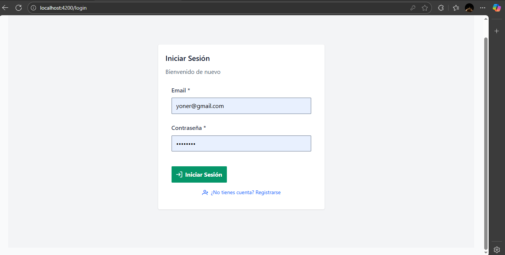
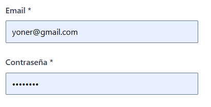
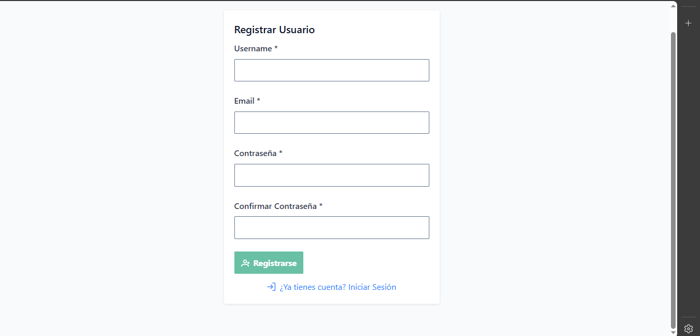
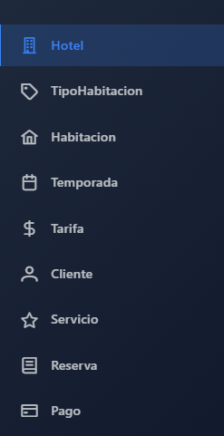
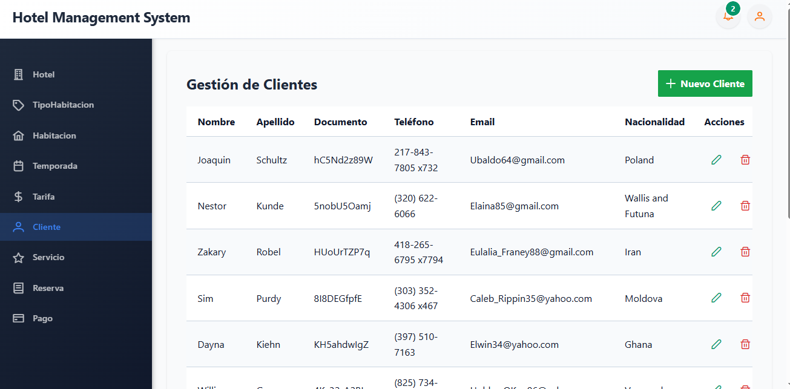

# 📖 MANUAL DEL USUARIO - SISTEMA DE GESTIÓN HOTELERA

## Introducción

Bienvenido al Manual del Usuario del Sistema de Gestión Hotelera "Hotel y Reservas". Este documento describe cómo utilizar todas las funcionalidades principales del sistema, con capturas de pantalla que muestran cada operación paso a paso.

---

## Índice de Contenidos

1. [Acceso al Sistema](#1-acceso-al-sistema)
2. [Panel Principal (Dashboard)](#2-panel-principal-dashboard)
3. [Gestión de Clientes](#3-gestión-de-clientes)
4. [Gestión de Hoteles](#4-gestión-de-hoteles)
5. [Gestión de Tipos de Habitación](#5-gestión-de-tipos-de-habitación)
6. [Gestión de Habitaciones](#6-gestión-de-habitaciones)
7. [Gestión de Reservaciones](#7-gestión-de-reservaciones)
8. [Gestión de Servicios](#8-gestión-de-servicios)
9. [Gestión de Pagos](#9-gestión-de-pagos)
10. [Gestión de Temporadas y Tarifas](#10-gestión-de-temporadas-y-tarifas)
11. [Gestión de Check-in/Check-out](#11-gestión-de-check-incheck-out)
12. [Preguntas Frecuentes](#12-preguntas-frecuentes)

---

## 1. Acceso al Sistema

### 1.1 Pantalla de Inicio de Sesión

**Descripción:** La primera pantalla que ve el usuario al acceder a la aplicación es la pantalla de login.

**Ubicación:** `http://localhost:4200`



```
Instrucciones para acceder:
1. Abra su navegador web
2. Ingrese la dirección: http://localhost:4200
3. Verá la pantalla de inicio de sesión
```

### 1.2 Completar Credenciales

**Campos requeridos:**
- **Email:** Ingrese su correo electrónico registrado
- **Contraseña:** Ingrese su contraseña



**Pasos:**
1. Haga clic en el campo de email
2. Ingrese su correo (ej: admin@hotel.com)
3. Haga clic en el campo de contraseña
4. Ingrese su contraseña
5. Haga clic en el botón "Iniciar Sesión"

### 1.3 Registro de Nuevo Usuario

**Para usuarios nuevos que desean crear una cuenta:**



**Pasos:**
1. Haga clic en "¿No tienes cuenta? Registrarse"
2. Complete los campos:
   - Nombre completo
   - Correo electrónico
   - Contraseña
   - Confirmar contraseña
3. Acepte los términos y condiciones
4. Haga clic en "Registrarse"

---

## 2. Panel Principal (Dashboard)

### 2.1 Vista General del Dashboard

**Descripción:** El dashboard es el panel de control principal donde puede ver un resumen de la información del hotel.

[INSERTAR AQUÍ CAPTURA DE PANTALLA: Dashboard General]

**Elementos principales:**
- Indicadores de ocupación
- Reservaciones pendientes
- Ingresos del día
- Huéspedes registrados
- Menú de navegación lateral

### 2.2 Navegación del Menú

**Elementos del menú:**

```
Menú Principal:
├── Dashboard
├── Clientes
├── Hoteles
├── Habitaciones
├── Tipos de Habitación
├── Reservaciones
├── Check-in
├── Check-out
├── Servicios
├── Pagos
├── Tarifas
├── Temporadas
└── Cerrar Sesión
```

---

## 3. Gestión de Clientes

### 3.1 Listar Clientes

**Descripción:** Ver todos los clientes registrados en el sistema.



**Pasos:**
1. Haga clic en "Clientes" en el menú lateral
2. Se mostrará la tabla con todos los clientes
3. Puede ver columnas: ID, Nombre, Apellido, Documento, Email, Teléfono, Estado

### 3.2 Crear Cliente (CREATE)

**Descripción:** Registrar un nuevo cliente en el sistema.

[INSERTAR AQUÍ CAPTURA DE PANTALLA: Formulario Crear Cliente]

**Pasos:**
1. En la lista de clientes, haga clic en el botón "Crear Cliente" o "+"
2. Complete el formulario con los siguientes campos:
   - **Nombre:** (Ej: Juan)
   - **Apellido:** (Ej: Pérez)
   - **Número de Documento:** (Ej: 12345678)
   - **Teléfono:** (Ej: 3001234567)
   - **Email:** (Ej: juan@example.com)
   - **Nacionalidad:** (Ej: Colombiana)
3. Haga clic en "Guardar"

[INSERTAR AQUÍ CAPTURA DE PANTALLA: Confirmación de Cliente Creado]

**Validaciones:**
- El email debe ser válido
- El documento debe ser único
- El teléfono debe tener formato correcto

### 3.3 Leer/Ver Cliente (READ)

**Descripción:** Ver los detalles de un cliente específico.

[INSERTAR AQUÍ CAPTURA DE PANTALLA: Detalle de Cliente]

**Pasos:**
1. En la lista de clientes, busque el cliente deseado
2. Haga clic en el botón "Ver" o en la fila del cliente
3. Se mostrará una ventana modal con todos los detalles

### 3.4 Actualizar Cliente (UPDATE)

**Descripción:** Modificar la información de un cliente existente.

[INSERTAR AQUÍ CAPTURA DE PANTALLA: Formulario Editar Cliente]

**Pasos:**
1. En la lista de clientes, identifique el cliente a editar
2. Haga clic en el botón "Editar" o en el icono de lápiz
3. Modifique los campos necesarios
4. Haga clic en "Actualizar"

[INSERTAR AQUÍ CAPTURA DE PANTALLA: Cliente Actualizado Exitosamente]

### 3.5 Eliminar Cliente (DELETE)

**Descripción:** Inactivar un cliente del sistema (eliminación lógica).

[INSERTAR AQUÍ CAPTURA DE PANTALLA: Diálogo de Confirmación Eliminar Cliente]

**Pasos:**
1. En la lista de clientes, busque el cliente a eliminar
2. Haga clic en el botón "Eliminar" o en el icono de basura
3. Confirme la acción en el diálogo que aparece
4. El cliente se marcará como INACTIVO

**Nota:** Los datos no se eliminan, solo se marcan como inactivos para mantener el histórico.

---

## 4. Gestión de Hoteles

### 4.1 Listar Hoteles

**Descripción:** Ver todos los hoteles disponibles en el sistema.

[INSERTAR AQUÍ CAPTURA DE PANTALLA: Listado de Hoteles]

**Columnas visibles:**
- ID
- Nombre del Hotel
- Dirección
- Ciudad
- País
- Teléfono
- Estrellas
- Estado

### 4.2 Crear Hotel (CREATE)

**Descripción:** Registrar un nuevo hotel en el sistema.

[INSERTAR AQUÍ CAPTURA DE PANTALLA: Formulario Crear Hotel]

**Pasos:**
1. Haga clic en "Hoteles" en el menú
2. Haga clic en "Crear Hotel" o "+"
3. Complete los campos:
   - **Nombre del Hotel:** (Ej: Hotel Plaza Mayor)
   - **Dirección:** (Ej: Calle 50 #10-50)
   - **Ciudad:** (Ej: Medellín)
   - **País:** (Ej: Colombia)
   - **Teléfono:** (Ej: +573001234567)
   - **Estrellas:** (1-5)
4. Haga clic en "Guardar"

[INSERTAR AQUÍ CAPTURA DE PANTALLA: Hotel Creado Exitosamente]

### 4.3 Leer/Ver Hotel (READ)

**Descripción:** Ver información detallada de un hotel.

[INSERTAR AQUÍ CAPTURA DE PANTALLA: Detalle de Hotel]

**Información mostrada:**
- Nombre y descripción
- Ubicación completa
- Contacto
- Clasificación en estrellas
- Estado operativo

### 4.4 Actualizar Hotel (UPDATE)

**Descripción:** Modificar datos del hotel.

[INSERTAR AQUÍ CAPTURA DE PANTALLA: Formulario Editar Hotel]

**Pasos:**
1. Localice el hotel en la lista
2. Haga clic en "Editar"
3. Modifique los campos requeridos
4. Haga clic en "Actualizar"

[INSERTAR AQUÍ CAPTURA DE PANTALLA: Hotel Actualizado]

### 4.5 Eliminar Hotel (DELETE)

**Descripción:** Inactivar un hotel.

[INSERTAR AQUÍ CAPTURA DE PANTALLA: Confirmación Eliminar Hotel]

**Pasos:**
1. Seleccione el hotel a eliminar
2. Haga clic en "Eliminar"
3. Confirme la acción

---

## 5. Gestión de Tipos de Habitación

### 5.1 Listar Tipos de Habitación

**Descripción:** Ver todas las categorías de habitaciones disponibles.

[INSERTAR AQUÍ CAPTURA DE PANTALLA: Listado de Tipos de Habitación]

**Información mostrada:**
- Nombre del tipo
- Descripción
- Máximo de personas
- Desayuno incluido (Sí/No)
- Estado

### 5.2 Crear Tipo de Habitación (CREATE)

**Descripción:** Agregar una nueva categoría de habitación.

[INSERTAR AQUÍ CAPTURA DE PANTALLA: Formulario Crear Tipo Habitación]

**Pasos:**
1. Haga clic en "Tipos de Habitación"
2. Haga clic en "Crear Tipo"
3. Complete:
   - **Nombre:** (Ej: Suite Presidencial)
   - **Descripción:** (Ej: Habitación de lujo con vista al mar)
   - **Máximo de Personas:** (Ej: 4)
   - **Desayuno Incluido:** (Sí/No)
4. Haga clic en "Guardar"

[INSERTAR AQUÍ CAPTURA DE PANTALLA: Tipo Creado Exitosamente]

### 5.3 Leer/Ver Tipo (READ)

**Descripción:** Ver detalles de una categoría de habitación.

[INSERTAR AQUÍ CAPTURA DE PANTALLA: Detalle Tipo Habitación]

### 5.4 Actualizar Tipo de Habitación (UPDATE)

**Descripción:** Modificar una categoría de habitación.

[INSERTAR AQUÍ CAPTURA DE PANTALLA: Editar Tipo Habitación]

**Pasos:**
1. Busque el tipo a modificar
2. Haga clic en "Editar"
3. Actualice los campos
4. Haga clic en "Actualizar"

### 5.5 Eliminar Tipo de Habitación (DELETE)

**Descripción:** Inactivar una categoría.

[INSERTAR AQUÍ CAPTURA DE PANTALLA: Eliminar Tipo Habitación]

---

## 6. Gestión de Habitaciones

### 6.1 Listar Habitaciones

**Descripción:** Ver todas las habitaciones del hotel.

[INSERTAR AQUÍ CAPTURA DE PANTALLA: Listado de Habitaciones]

**Columnas:**
- Número de habitación
- Piso
- Capacidad
- Tipo de habitación
- Precio base
- Disponibilidad
- Estado

### 6.2 Crear Habitación (CREATE)

**Descripción:** Registrar una nueva habitación.

[INSERTAR AQUÍ CAPTURA DE PANTALLA: Formulario Crear Habitación]

**Pasos:**
1. Haga clic en "Habitaciones"
2. Haga clic en "Crear Habitación"
3. Complete:
   - **Número:** (Ej: 301)
   - **Piso:** (Ej: 3)
   - **Capacidad:** (Ej: 2)
   - **Descripción:** (Ej: Habitación con vista a la piscina)
   - **Precio Base:** (Ej: 150000)
   - **Hotel:** (Seleccione de la lista)
   - **Tipo de Habitación:** (Seleccione de la lista)
   - **Disponible:** (Marque si está disponible)
4. Haga clic en "Guardar"

[INSERTAR AQUÍ CAPTURA DE PANTALLA: Habitación Creada]

### 6.3 Leer/Ver Habitación (READ)

**Descripción:** Ver detalles completos de una habitación.

[INSERTAR AQUÍ CAPTURA DE PANTALLA: Detalle Habitación]

### 6.4 Actualizar Habitación (UPDATE)

**Descripción:** Modificar información de una habitación.

[INSERTAR AQUÍ CAPTURA DE PANTALLA: Editar Habitación]

**Pasos:**
1. Localice la habitación
2. Haga clic en "Editar"
3. Modifique los campos
4. Haga clic en "Actualizar"

[INSERTAR AQUÍ CAPTURA DE PANTALLA: Habitación Actualizada]

### 6.5 Eliminar Habitación (DELETE)

**Descripción:** Inactivar una habitación.

[INSERTAR AQUÍ CAPTURA DE PANTALLA: Eliminar Habitación]

---

## 7. Gestión de Reservaciones

### 7.1 Listar Reservaciones

**Descripción:** Ver todas las reservaciones del sistema.

[INSERTAR AQUÍ CAPTURA DE PANTALLA: Listado de Reservaciones]

**Información mostrada:**
- Número de reserva
- Cliente
- Habitación
- Fecha entrada
- Fecha salida
- Número de huéspedes
- Monto total
- Estado

### 7.2 Crear Reservación (CREATE)

**Descripción:** Registrar una nueva reservación.

[INSERTAR AQUÍ CAPTURA DE PANTALLA: Formulario Crear Reservación]

**Pasos:**
1. Haga clic en "Reservaciones"
2. Haga clic en "Crear Reservación"
3. Complete:
   - **Cliente:** (Seleccione de la lista)
   - **Habitación:** (Seleccione de la lista)
   - **Fecha de Entrada:** (Seleccione del calendario)
   - **Fecha de Salida:** (Seleccione del calendario)
   - **Número de Huéspedes:** (Ej: 2)
   - **Monto Total:** (Sistema puede calcular automáticamente)
4. Haga clic en "Guardar"

[INSERTAR AQUÍ CAPTURA DE PANTALLA: Reservación Creada Exitosamente]

### 7.3 Leer/Ver Reservación (READ)

**Descripción:** Ver detalles de una reservación.

[INSERTAR AQUÍ CAPTURA DE PANTALLA: Detalle Reservación]

**Información incluida:**
- Datos del cliente
- Datos de la habitación
- Fechas de la reserva
- Monto e historial de pagos
- Estado de la reservación

### 7.4 Actualizar Reservación (UPDATE)

**Descripción:** Modificar datos de una reservación existente.

[INSERTAR AQUÍ CAPTURA DE PANTALLA: Editar Reservación]

**Campos que se pueden modificar:**
- Fechas de entrada/salida
- Número de huéspedes
- Habitación asignada
- Monto total

**Pasos:**
1. Localice la reservación
2. Haga clic en "Editar"
3. Realice los cambios
4. Haga clic en "Actualizar"

[INSERTAR AQUÍ CAPTURA DE PANTALLA: Reservación Actualizada]

### 7.5 Eliminar Reservación (DELETE)

**Descripción:** Cancelar una reservación.

[INSERTAR AQUÍ CAPTURA DE PANTALLA: Cancelar Reservación]

**Pasos:**
1. Seleccione la reservación
2. Haga clic en "Cancelar" o "Eliminar"
3. Confirme la cancelación

---

## 8. Gestión de Servicios

### 8.1 Listar Servicios

**Descripción:** Ver todos los servicios adicionales disponibles.

[INSERTAR AQUÍ CAPTURA DE PANTALLA: Listado de Servicios]

**Información:**
- Nombre del servicio
- Descripción
- Precio
- Categoría
- Estado

### 8.2 Crear Servicio (CREATE)

**Descripción:** Agregar un nuevo servicio adicional.

[INSERTAR AQUÍ CAPTURA DE PANTALLA: Formulario Crear Servicio]

**Pasos:**
1. Haga clic en "Servicios"
2. Haga clic en "Crear Servicio"
3. Complete:
   - **Nombre:** (Ej: Spa y Masaje)
   - **Descripción:** (Ej: Masaje relajante de 60 minutos)
   - **Precio:** (Ej: 150000)
   - **Categoría:** (Ej: Bienestar)
4. Haga clic en "Guardar"

[INSERTAR AQUÍ CAPTURA DE PANTALLA: Servicio Creado]

### 8.3 Leer/Ver Servicio (READ)

**Descripción:** Ver detalles de un servicio.

[INSERTAR AQUÍ CAPTURA DE PANTALLA: Detalle Servicio]

### 8.4 Actualizar Servicio (UPDATE)

**Descripción:** Modificar información de un servicio.

[INSERTAR AQUÍ CAPTURA DE PANTALLA: Editar Servicio]

### 8.5 Eliminar Servicio (DELETE)

**Descripción:** Inactivar un servicio.

[INSERTAR AQUÍ CAPTURA DE PANTALLA: Eliminar Servicio]

---

## 9. Gestión de Pagos

### 9.1 Listar Pagos

**Descripción:** Ver historial de pagos realizados.

[INSERTAR AQUÍ CAPTURA DE PANTALLA: Listado de Pagos]

**Información mostrada:**
- ID del pago
- Reservación asociada
- Monto pagado
- Método de pago
- Fecha del pago
- Referencia
- Estado

### 9.2 Crear Pago (CREATE)

**Descripción:** Registrar un nuevo pago para una reservación.

[INSERTAR AQUÍ CAPTURA DE PANTALLA: Formulario Crear Pago]

**Pasos:**
1. Haga clic en "Pagos"
2. Haga clic en "Crear Pago"
3. Complete:
   - **Reservación:** (Seleccione de la lista)
   - **Monto:** (Ej: 500000)
   - **Método de Pago:** (Efectivo, Tarjeta, Transferencia, etc.)
   - **Moneda:** (Ej: COP)
   - **Fecha del Pago:** (Seleccione del calendario)
   - **Referencia:** (Ej: TXN123456)
4. Haga clic en "Guardar"

[INSERTAR AQUÍ CAPTURA DE PANTALLA: Pago Registrado Exitosamente]

### 9.3 Leer/Ver Pago (READ)

**Descripción:** Ver detalles de un pago específico.

[INSERTAR AQUÍ CAPTURA DE PANTALLA: Detalle Pago]

### 9.4 Actualizar Pago (UPDATE)

**Descripción:** Modificar información de un pago (si es necesario).

[INSERTAR AQUÍ CAPTURA DE PANTALLA: Editar Pago]

### 9.5 Eliminar Pago (DELETE)

**Descripción:** Cancelar un pago.

[INSERTAR AQUÍ CAPTURA DE PANTALLA: Cancelar Pago]

---

## 10. Gestión de Temporadas y Tarifas

### 10.1 Gestión de Temporadas

#### 10.1.1 Listar Temporadas

**Descripción:** Ver todas las temporadas definidas.

[INSERTAR AQUÍ CAPTURA DE PANTALLA: Listado de Temporadas]

**Información:**
- Nombre de la temporada
- Fecha inicio
- Fecha fin
- Multiplicador de precio
- Estado

#### 10.1.2 Crear Temporada (CREATE)

**Descripción:** Crear una nueva temporada con precios especiales.

[INSERTAR AQUÍ CAPTURA DE PANTALLA: Formulario Crear Temporada]

**Pasos:**
1. Haga clic en "Temporadas"
2. Haga clic en "Crear Temporada"
3. Complete:
   - **Nombre:** (Ej: Semana Santa)
   - **Fecha Inicio:** (Seleccione del calendario)
   - **Fecha Fin:** (Seleccione del calendario)
   - **Multiplicador de Precio:** (Ej: 1.5 = 50% más caro)
4. Haga clic en "Guardar"

[INSERTAR AQUÍ CAPTURA DE PANTALLA: Temporada Creada]

#### 10.1.3 Leer/Ver Temporada (READ)

[INSERTAR AQUÍ CAPTURA DE PANTALLA: Detalle Temporada]

#### 10.1.4 Actualizar Temporada (UPDATE)

[INSERTAR AQUÍ CAPTURA DE PANTALLA: Editar Temporada]

#### 10.1.5 Eliminar Temporada (DELETE)

[INSERTAR AQUÍ CAPTURA DE PANTALLA: Eliminar Temporada]

### 10.2 Gestión de Tarifas

#### 10.2.1 Listar Tarifas

**Descripción:** Ver todas las tarifas por tipo de habitación y temporada.

[INSERTAR AQUÍ CAPTURA DE PANTALLA: Listado de Tarifas]

#### 10.2.2 Crear Tarifa (CREATE)

**Descripción:** Crear una nueva tarifa.

[INSERTAR AQUÍ CAPTURA DE PANTALLA: Formulario Crear Tarifa]

**Pasos:**
1. Haga clic en "Tarifas"
2. Haga clic en "Crear Tarifa"
3. Complete:
   - **Tipo de Habitación:** (Seleccione)
   - **Temporada:** (Seleccione)
   - **Precio:** (Ingrese el precio)
4. Haga clic en "Guardar"

[INSERTAR AQUÍ CAPTURA DE PANTALLA: Tarifa Creada]

#### 10.2.3 Leer/Ver Tarifa (READ)

[INSERTAR AQUÍ CAPTURA DE PANTALLA: Detalle Tarifa]

#### 10.2.4 Actualizar Tarifa (UPDATE)

[INSERTAR AQUÍ CAPTURA DE PANTALLA: Editar Tarifa]

#### 10.2.5 Eliminar Tarifa (DELETE)

[INSERTAR AQUÍ CAPTURA DE PANTALLA: Eliminar Tarifa]

---

## 11. Gestión de Check-in/Check-out

### 11.1 Gestión de Check-in

#### 11.1.1 Listar Check-ins

**Descripción:** Ver todos los check-ins registrados.

[INSERTAR AQUÍ CAPTURA DE PANTALLA: Listado de Check-ins]

**Información:**
- Reservación asociada
- Cliente
- Habitación
- Fecha y hora de check-in
- Personal que registró

#### 11.1.2 Crear Check-in (CREATE)

**Descripción:** Registrar la entrada de un huésped.

[INSERTAR AQUÍ CAPTURA DE PANTALLA: Formulario Check-in]

**Pasos:**
1. Haga clic en "Check-in"
2. Haga clic en "Nuevo Check-in"
3. Complete:
   - **Reservación:** (Seleccione de la lista)
   - **Fecha y Hora:** (Se completa automáticamente)
   - **Notas:** (Observaciones adicionales)
4. Haga clic en "Confirmar Check-in"

[INSERTAR AQUÍ CAPTURA DE PANTALLA: Check-in Confirmado]

#### 11.1.3 Leer/Ver Check-in (READ)

[INSERTAR AQUÍ CAPTURA DE PANTALLA: Detalle Check-in]

#### 11.1.4 Actualizar Check-in (UPDATE)

[INSERTAR AQUÍ CAPTURA DE PANTALLA: Editar Check-in]

#### 11.1.5 Eliminar Check-in (DELETE)

[INSERTAR AQUÍ CAPTURA DE PANTALLA: Eliminar Check-in]

### 11.2 Gestión de Check-out

#### 11.2.1 Listar Check-outs

**Descripción:** Ver todos los check-outs realizados.

[INSERTAR AQUÍ CAPTURA DE PANTALLA: Listado de Check-outs]

#### 11.2.2 Crear Check-out (CREATE)

**Descripción:** Registrar la salida de un huésped.

[INSERTAR AQUÍ CAPTURA DE PANTALLA: Formulario Check-out]

**Pasos:**
1. Haga clic en "Check-out"
2. Haga clic en "Nuevo Check-out"
3. Seleccione la reservación
4. Verifique que todos los pagos estén completos
5. Complete:
   - **Fecha y Hora:** (Se completa automáticamente)
   - **Estado de la Habitación:** (Limpia/Sucia)
   - **Notas:** (Comentarios adicionales)
6. Haga clic en "Confirmar Check-out"

[INSERTAR AQUÍ CAPTURA DE PANTALLA: Check-out Confirmado]

#### 11.2.3 Leer/Ver Check-out (READ)

[INSERTAR AQUÍ CAPTURA DE PANTALLA: Detalle Check-out]

#### 11.2.4 Actualizar Check-out (UPDATE)

[INSERTAR AQUÍ CAPTURA DE PANTALLA: Editar Check-out]

#### 11.2.5 Eliminar Check-out (DELETE)

[INSERTAR AQUÍ CAPTURA DE PANTALLA: Eliminar Check-out]

---

## 12. Preguntas Frecuentes

### P: ¿Cómo cambio mi contraseña?
**R:** En el menú principal, haga clic en su perfil en la esquina superior derecha y seleccione "Cambiar Contraseña".

[INSERTAR AQUÍ CAPTURA DE PANTALLA: Cambiar Contraseña]

### P: ¿Qué pasa si elimino un cliente que tiene reservaciones activas?
**R:** El sistema no permite eliminar un cliente con reservaciones activas. Primero debe cancelar todas sus reservaciones.

### P: ¿Puedo recuperar datos eliminados?
**R:** Los datos no se elimina físicamente, solo se marcan como inactivos. Puede reactivarlos si lo necesita. Contacte al administrador.

### P: ¿Cómo exporto un reporte de reservaciones?
**R:** En la lista de reservaciones, haga clic en el botón "Exportar" o "Descargar PDF".

[INSERTAR AQUÍ CAPTURA DE PANTALLA: Exportar Reporte]

### P: ¿Qué métodos de pago acepta el sistema?
**R:** El sistema acepta: Efectivo, Tarjeta de Crédito, Tarjeta de Débito, Transferencia Bancaria.

### P: ¿Cómo veo el historial de pagos de una reservación?
**R:** Abra la reservación y en la sección de "Pagos" verá todo el historial.

[INSERTAR AQUÍ CAPTURA DE PANTALLA: Historial de Pagos]

### P: ¿Puedo modificar una reservación después de hacer check-in?
**R:** Sí, pero solo ciertos campos como notas o servicios adicionales. Las fechas se pueden ajustar previa aprobación del administrador.

### P: ¿Cómo configuro nuevas temporadas?
**R:** Vaya a "Temporadas", clic en "Crear Temporada", complete los datos y guarde. Luego asigne tarifas a cada tipo de habitación.

---

## Conclusión

Este manual proporciona una guía completa para utilizar todas las funcionalidades del Sistema de Gestión Hotelera. Para preguntas adicionales o soporte técnico, contacte al equipo de administración del sistema.

**Versión del Manual:** 1.0  
**Fecha:** Noviembre 19, 2025  
**Sistema:** Hotel y Reservas v1.0
