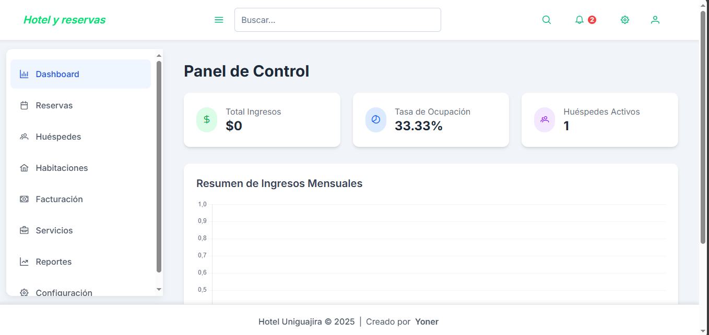
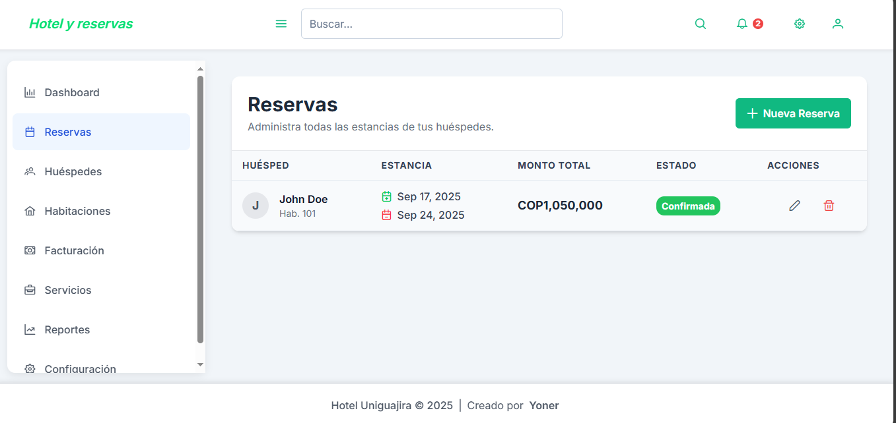
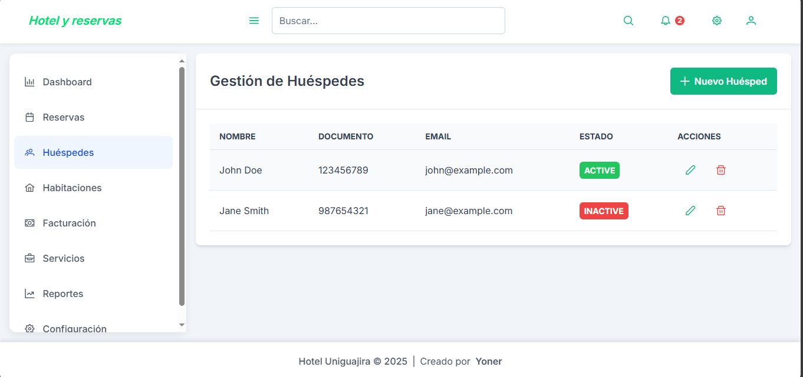
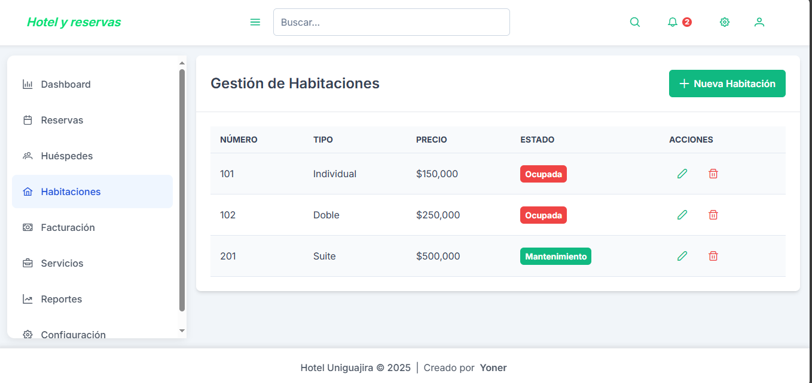
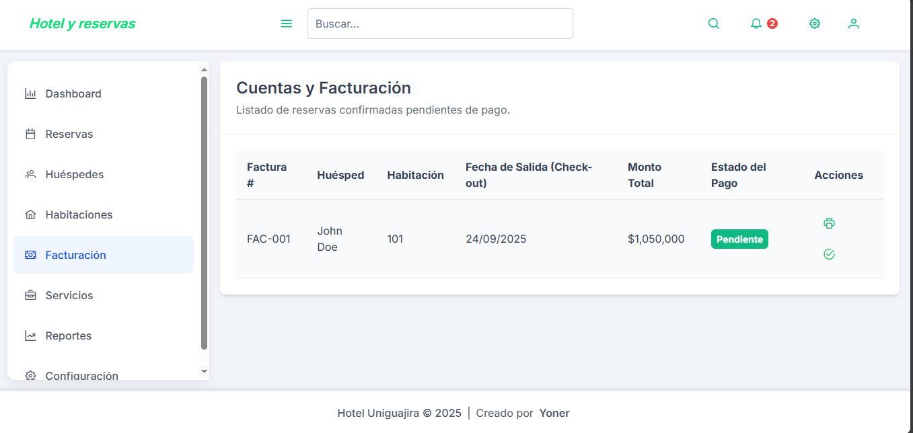
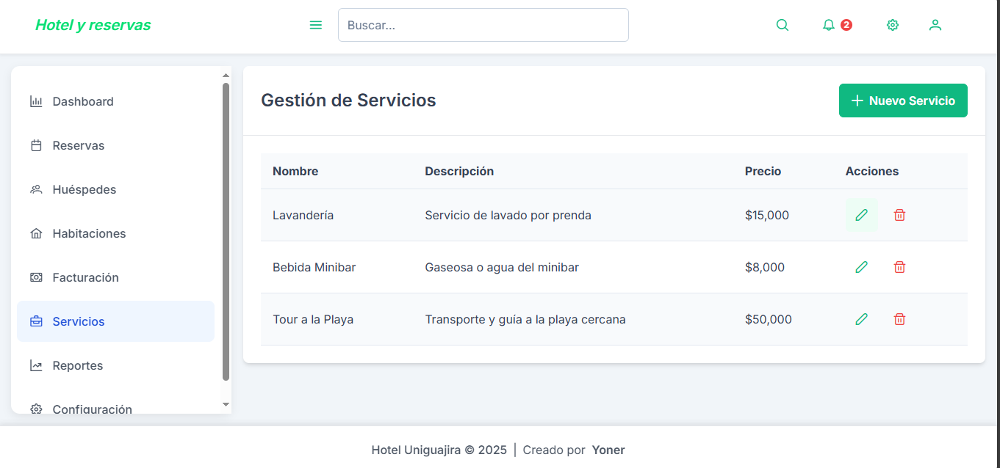
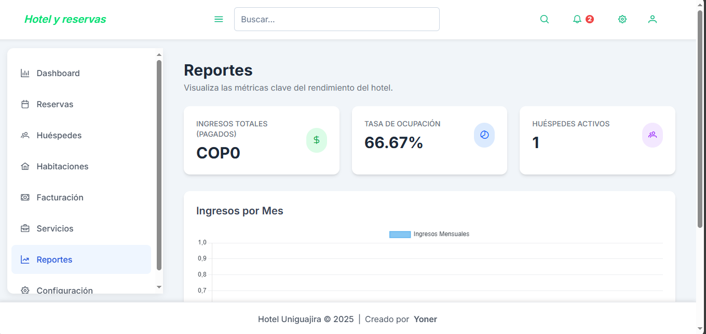
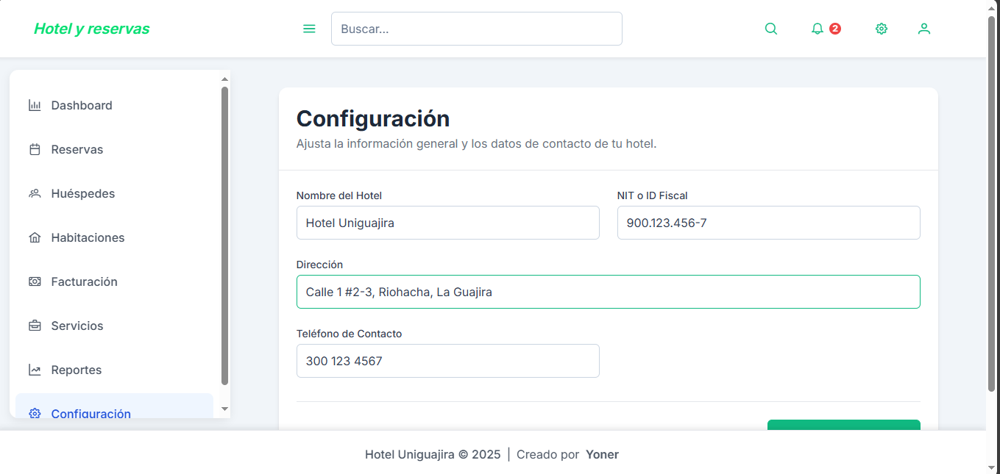

# Hotel y Reservas

Este proyecto es un sistema web de gestión para hoteles que permite administrar de forma sencilla y organizada las diferentes operaciones relacionadas con reservas, huéspedes, habitaciones, facturación, servicios y reportes.  
Está diseñado para mejorar la experiencia tanto de los administradores del hotel como de los clientes que realizan reservas.

---

## Funcionalidades principales

- **Dashboard**: Vista general con indicadores y accesos rápidos a las funciones principales.
- **Reservas**: Gestión completa de reservas de habitaciones con control de fechas, disponibilidad y estado.
- **Huéspedes**: Registro y administración de la información de los huéspedes.
- **Habitaciones**: Control de habitaciones disponibles, tipos, precios y estado.
- **Facturación**: Emisión de facturas asociadas a las reservas y servicios.
- **Servicios**: Administración de servicios adicionales ofrecidos por el hotel.
- **Reportes**: Generación de reportes para análisis de ocupación, ingresos y estadísticas relevantes.
- **Configuración**: Personalización y ajustes generales del sistema.

---

## Capturas de pantalla

A continuación se muestran las vistas principales del sistema. Cada sección tiene su captura correspondiente:  

### Dashboard  


### Reservas  


### Huéspedes  


### Habitaciones  


### Facturación  


### Servicios  


### Reportes  


### Configuración  


---

## Tecnologías utilizadas

- **Frontend**: (Ejemplo: React, TailwindCSS, etc.)
- **Backend**: (Ejemplo: Node.js, Express, etc.)
- **Base de datos**: (Ejemplo: MySQL, MongoDB, etc.)
- **Control de versiones**: Git y GitHub

*(Completa esta sección con las tecnologías específicas que hayas usado en tu proyecto.)*

---

## Instalación y ejecución

1. Clonar este repositorio:  
   ```bash
   git clone https://github.com/usuario/hotel-y-reservas.git
